# GK App — Complete End-to-End Technical Architecture & Engineering Specification

**Document Type:** System Architecture / Engineering Specification
**Source:** Actual Application Repository (`/Users/nishthaagarwal/GK`)
**Architecture Status:** As-Is + Recommended Future State
**Generated Through:** Repository-Level Code Inspection
**Last Updated:** 2026-08-18

---

## 0. How to read this document

Every architectural statement is tagged with one of these confidence levels:

| Tag | Meaning |
|-----|---------|
| **[VERIFIED]** | Implemented and confirmed by reading the source file(s) cited. |
| **[PARTIAL]** | Implemented, but incomplete or only covers part of the intended scope. |
| **[CONFIG-UNUSED]** | Present in config/schema but not exercised by any current code path or data. |
| **[INFERRED]** | Reasoned from code, not from an explicit statement/comment. |
| **[FUTURE]** | Recommendation / not present today. |
| **[N/A]** | The generic capability does not exist in this repo (and, given the architecture, is not expected to). |

> **Cardinal rule honoured:** This document first reverse-engineers *this* repository. It does **not** describe an idealized GK app and pretend it is this one. Large parts of the "standard" architecture prompt (backend, database server, runtime AI, auth server, payments, queues, analytics) **do not exist here** — they are marked **[N/A]** with a short reason and, where useful, a **[FUTURE]** recommendation.

### The single most important fact about this system

**GK Quest is a 100% client-side, offline-first React single-page application. There is no backend, no database server, no API layer, no authentication server, no runtime AI/LLM, no analytics, and no network calls at runtime except loading Google Fonts.** All state lives in the browser's `localStorage`; all content is static JSON shipped with the app. This single fact reshapes every section below.

---

## 1. Executive Technical Summary

### 1.1 What the app is
**[VERIFIED — `CLAUDE.md`, `README.md`, `src/`]** GK Quest is a daily, gamified General Knowledge game built as an installable PWA for a single Class-5 child (~10 y/o, Gurugram, India). It is structured as a **90-day journey** (3 "worlds" of 30 days), one themed quest per day, 12 questions on normal days and 15 on boss days, wrapped in XP, coins, stars, streaks, badges, levels, and a celebration after each quest.

### 1.2 Who it is for
**[VERIFIED]** Primary user: one child. Secondary user: a parent (light PIN-gated dashboard + settings). No multi-user, no accounts, no roles enforced by any server.

### 1.3 Core user journey
**[VERIFIED — `src/screens/*`]** First-time Welcome → Journey Map (Home) → tap the current day → Quest (one question at a time, instant feedback + "Did you know?" fact) → Results (stars, XP, coins, badges, recap) → back to the map with the next day unlocked. Optional side routes: Trophy Room, Shop, Parent Dashboard, Settings.

### 1.4 Major capabilities (all client-side)
Journey map with serpentine 90-day path • quiz engine with 7 question types • scoring (base + speed bonus + combo multiplier) • star rating • XP → 9-rank level ladder • coins & cosmetic shop • daily streak with freeze tokens • 20 badges • Trophy Room + downloadable certificate • Parent Dashboard (PIN, strengths/weaknesses, Practice Mode toggle) • Settings (name, sound, PIN) • export/import/reset progress • synthesized sound effects • PWA install + full offline.

### 1.5 Stack at a glance

| Concern | Reality |
|--------|---------|
| Frontend | **[VERIFIED]** React 18.3 + Vite 5.4 (JavaScript, no TypeScript) |
| Styling | **[VERIFIED]** Tailwind CSS 3.4 + custom theme; Google Fonts (Baloo 2, Fredoka) |
| Animation | **[VERIFIED]** Framer Motion 11 + canvas-confetti 1.9 |
| Routing | **[VERIFIED]** react-router-dom 6.28 (client-side, `BrowserRouter`) |
| State / persistence | **[VERIFIED]** React Context + a single `localStorage` key |
| Content | **[VERIFIED]** 27 static JSON files (days 1–20, 68–74), code-split by Vite |
| Backend / DB / API | **[N/A]** none — no server code anywhere in the repo |
| Auth | **[PARTIAL]** client-only 4-digit "parent PIN" in `localStorage`; no real authentication |
| AI at runtime | **[N/A]** none — content is authored offline (by Claude), then shipped as JSON |
| Analytics / monitoring | **[N/A]** none |
| PWA / offline | **[VERIFIED]** vite-plugin-pwa (Workbox) precache + Google-Fonts runtime cache |
| Hosting | **[INFERRED — `README.md`, `public/_redirects`]** any static host; Netlify drag-drop is the documented path |
| Tests / CI/CD / Docker | **[N/A]** none present |

### 1.6 One-page architecture

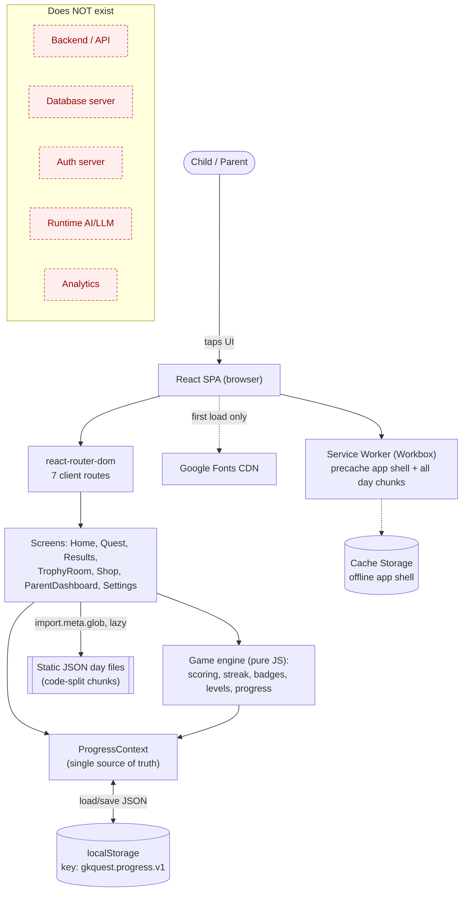

**Reading the diagram:** every box left of "Does NOT exist" runs entirely inside the user's browser tab. There is no network hop for game logic or data after the first load.

---

## 2. Complete Technology Stack

**[VERIFIED — `package.json`, `package-lock.json`, config files]**

| Layer | Technology | Version (declared) | Purpose | Where used | Notes |
|------|-----------|--------------------|---------|-----------|-------|
| Runtime | React | ^18.3.1 | UI library | everywhere | `main.jsx` root render |
| Runtime | react-dom | ^18.3.1 | DOM renderer | `main.jsx` | `createRoot` |
| Routing | react-router-dom | ^6.28.0 | client routes | `App.jsx`, all screens | `BrowserRouter` in `main.jsx` |
| Animation | framer-motion | ^11.11.17 | transitions/gestures | every screen & component | heavy use |
| Delight | canvas-confetti | ^1.9.3 | confetti bursts | `Quest`, `Results`, `LevelUpOverlay` | |
| Build | vite | ^5.4.11 | dev server + bundler | root | `vite.config.js` |
| Build | @vitejs/plugin-react | ^4.3.4 | React fast-refresh/JSX | `vite.config.js` | |
| PWA | vite-plugin-pwa | ^1.3.0 | manifest + service worker (Workbox) | `vite.config.js` | `registerType: autoUpdate` |
| Styling | tailwindcss | ^3.4.15 | utility CSS | `index.css`, all JSX | custom theme in `tailwind.config.js` |
| Styling | postcss | ^8.4.49 | CSS pipeline | `postcss.config.js` | |
| Styling | autoprefixer | ^10.4.20 | vendor prefixes | `postcss.config.js` | |
| Fonts | Baloo 2, Fredoka | Google Fonts | kid-friendly type | `index.html` `<link>`, Tailwind `fontFamily` | runtime-cached by SW |

**Client framework choices not present:** Next.js, TypeScript, shadcn/ui, Redux/Zustand/MobX, react-query/SWR, form libraries, validation libraries, chart libraries. **[N/A]**

**Backend / Database / AI / Infra / Observability tooling:** **[N/A]** — nothing found in `package.json`, config, or source. No Node/Express/Nest/FastAPI/Django, no Mongo/Postgres/Firebase/Redis/SQLite/vector DB, no OpenAI/Anthropic/Gemini/ElevenLabs/etc. SDK, no Docker/AWS/GCP/Vercel config files, no Sentry/PostHog/GA/Mixpanel/Langfuse.

> **[INFERRED]** The media-generation MCP tooling used to build the marketing video during development is **not** part of the app and is **not** a runtime dependency. It never ships to users.

---

## 3. Repository Architecture

### 3.1 Actual tree (excluding `node_modules`, `dist`, `.git`)

```text
GK/
├── CLAUDE.md                     # design brief / project instructions (source of truth for intent)
├── GK-Quest-App-Plan.md          # original long-form plan
├── README.md                     # run/build/deploy guide
├── index.html                    # SPA entry, fonts, PWA meta
├── package.json                  # deps + 3 scripts (dev/build/preview)
├── package-lock.json
├── vite.config.js                # Vite + PWA (manifest + Workbox) config
├── tailwind.config.js            # theme: fonts, colours, radii, shadows, keyframes
├── postcss.config.js
├── .gitignore
├── .claude/
│   ├── launch.json               # dev-server launch config (npm run dev, port 5173)
│   └── settings.local.json       # Claude Code local permission allowlist (dev tool only)
├── public/                       # copied verbatim into dist/
│   ├── _redirects                # Netlify SPA fallback (/* -> /index.html 200)
│   ├── favicon.svg
│   ├── apple-touch-icon.png
│   ├── icon-192.png
│   └── icon-512.png
├── promo/                        # MARKETING assets — NOT part of the app build
│   ├── end2.html, endcard.html, endscene.html   # ad end-card animations
│   └── image2.jpeg
├── dist/                         # build output (generated; see §57)
└── src/
    ├── main.jsx                  # React root: BrowserRouter > ProgressProvider > App
    ├── App.jsx                   # <Routes> (7 routes) + ThemeApplier + SoundSync
    ├── index.css                 # Tailwind layers + design-system component classes
    ├── assets/README.md          # (placeholder; no binary assets tracked)
    ├── components/               # 22 files — reusable UI + 7 question renderers
    ├── data/                     # 27 day-*.json content files + schema.md
    ├── game/                     # 16 files — the pure-JS "engine" + persistence
    └── screens/                  # 7 route screens
```

### 3.2 Directory responsibilities

| Directory | Purpose | Active? | Key files |
|-----------|---------|---------|-----------|
| `src/game/` | All non-UI logic: scoring, levels, streak, badges, journey, progress reducer, storage, content loading, sound, certificate, shuffle, dates, shop catalog. Pure & testable. | **Active** | `progress.js`, `scoring.js`, `streak.js`, `badges.js`, `storage.js`, `ProgressContext.jsx` |
| `src/screens/` | One component per route. Compose engine + components. | **Active** | `Home.jsx`, `Quest.jsx`, `Results.jsx` |
| `src/components/` | Presentational UI + the 7 question-type renderers, wired through a registry in `Quest.jsx`. | **Active** | `OptionButton.jsx`, `MatchQuestion.jsx`, `Welcome.jsx` |
| `src/data/` | Static content, one JSON per day + the schema contract. | **Active (partial content)** | `schema.md`, `day-01.json` … |
| `public/` | Static passthrough assets + SPA redirect + icons. | **Active** | `_redirects` |
| `promo/` | Marketing video end-cards. **Ships nowhere** (outside `public/`, not imported by `src/`). | **Not part of app** | — |
| `.claude/` | Dev-tooling config (launch + local permissions). | **Dev only** | — |

### 3.3 Dead code / duplication / legacy
- **[VERIFIED]** `index.css` defines a `.btn-answer` and `.btn-success` component class; `.btn-answer` is **not referenced** by any screen/component (answer buttons use `OptionButton`/bespoke styles). `.btn-success` is likewise unused. → **minor dead CSS.**
- **[VERIFIED]** `Mascot.jsx` `FACE` map has three keys (`idle/happy/wrong`) all pointing to the same `🦉` emoji — intentional (mood drives animation/bubble, not the face), not dead but redundant-looking.
- **[VERIFIED]** `ImageMCQQuestion` is fully implemented and registered, but **no current question uses `type: "image_mcq"`** (0 across all 27 files) → **[CONFIG-UNUSED] renderer.**
- **[VERIFIED]** No `.vscode/`, no experimental folders, no generated code checked in besides `dist/`.

---

## 4. System Context (C4 Level 1)

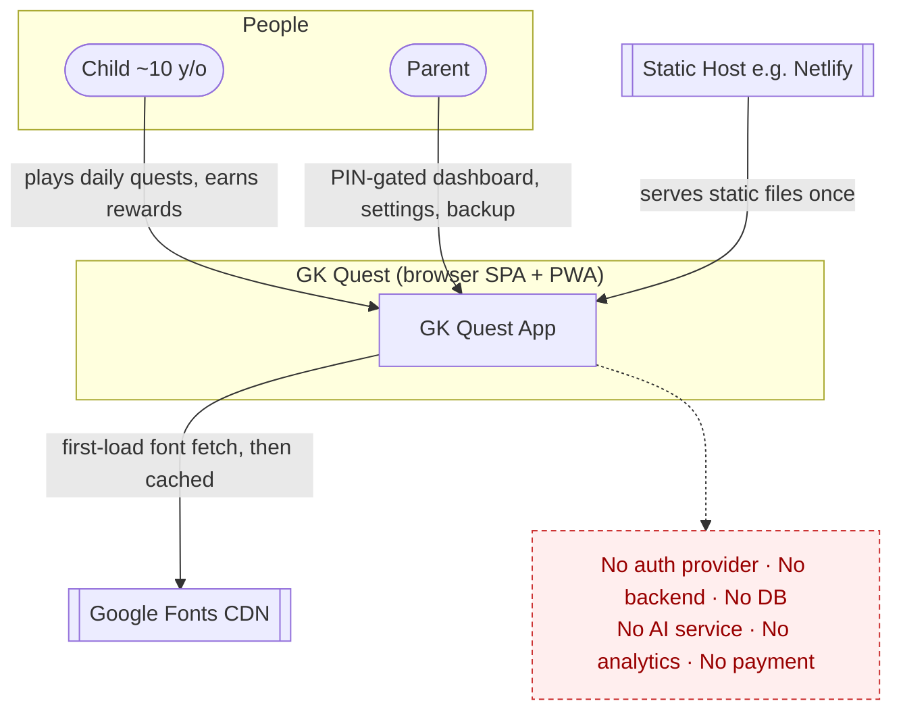

**Actors:** Child (primary), Parent (secondary). **External systems:** exactly two — the static host (serves files) and Google Fonts (first-load only). Admin / content team / AI services / payment provider / notification service: **[N/A].** Content is authored offline and committed as JSON.

---

## 5. Container Architecture (C4 Level 2)

**[VERIFIED]** There is effectively **one container**: the browser SPA. The service worker is a second in-browser execution context.

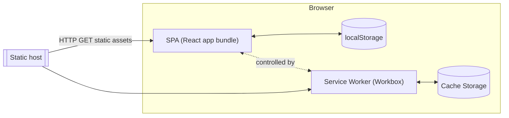

| Container | Tech | Responsibility | Communication |
|-----------|------|----------------|---------------|
| SPA bundle | React/Vite | all UI + logic | direct function calls; `localStorage` R/W |
| Service worker | Workbox | offline precache, navigation fallback, font runtime cache | fetch interception |
| localStorage | Web Storage | durable player state (one JSON blob) | synchronous API |
| Cache Storage | Cache API | offline app shell + day chunks | via SW |

No inter-service protocols (REST/WebSocket/SSE/RPC/queue) exist — everything is in-process. **[N/A]** for network protocols.

---

## 6. Frontend Architecture

### 6.1 Bootstrap
**[VERIFIED — `src/main.jsx`]**
```jsx
ReactDOM.createRoot(#root).render(
  <BrowserRouter><ProgressProvider><App/></ProgressProvider></BrowserRouter>
)
```
- **No `React.StrictMode`** — deliberately omitted (comment: StrictMode's double-mount froze Framer Motion entrance animations). **[VERIFIED]**
- Providers: exactly one app-level provider, `ProgressProvider` (`src/game/ProgressContext.jsx`).
- Global side-effect components mounted in `App.jsx`: `ThemeApplier` (writes `document.body.style.background`), `SoundSync` (mirrors mute flag into the sound engine).
- Global styles: `src/index.css` (Tailwind layers + `.btn-fun`, `.card-fun`, `.pill`, safe-area helpers, fluid type).

### 6.2 Routing table
**[VERIFIED — `src/App.jsx`]**

| Route | Screen | Auth | Main components | "API" calls |
|-------|--------|------|-----------------|-------------|
| `/` | `Home` | none | `Welcome` (if not onboarded), `Stone`, `NavBtn` | none (reads Context) |
| `/quest/:day` | `Quest` | none | question registry (7), `ProgressBar`, `FunFactCard`, `Mascot` | `loadDay()` / `loadMixedQuiz()` lazy import |
| `/results` | `Results` | none | `LevelUpOverlay`, `BadgeChip`, `Mascot` | none (reads router `state`) |
| `/trophy` | `TrophyRoom` | none | `BadgeChip`, `downloadCertificate` | none |
| `/shop` | `Shop` | none | `ShopItem`, `Section` | none |
| `/parent` | `ParentDashboard` | **PIN gate (client)** | `PinInput`, `Toggle` | none |
| `/settings` | `Settings` | none (reachable via parent) | `PinInput` | none |

- `:day` accepts a number **or** the literal `practice` (`isPractice = day === 'practice'`). **[VERIFIED]**
- No route guards other than the in-component PIN gate on `/parent`. `/settings` is **not** itself PIN-gated (reachable directly by URL). **[VERIFIED — potential gap, see §14/§51].**
- No 404 route; unknown paths render nothing (SPA fallback serves `index.html`, React shows empty `<Routes>`). **[INFERRED]**

### 6.3 Screens (detail)

Below, "state" = React local state; "global" = `ProgressContext`.

**Home (`src/screens/Home.jsx`, 324 lines)** — the Journey Map.
- Purpose: render 90 day-nodes across 3 worlds in a serpentine grid; HUD (avatar, rank, XP bar, streak, coins); sticky Play button; backup/restore panel; first-run `Welcome` overlay.
- Local state: `notice`, `showBackup`; refs `fileRef`, `currentRef`.
- Global: `progress`, `exportProgress`, `importProgress`, `resetProgress`.
- Derived: `rank = levelForXp(xp)`, `contentSet = new Set(availableDays())`, `gate = canStartDay(...)`, per-world completion counts.
- Events: tap a stone → `play(day)` → `navigate('/quest/'+day)` (only if content exists); export → Blob download; import → `FileReader` → `importProgress`; reset → `window.confirm` → `resetProgress`.
- Empty/locked states: future days render 🔒; days without a content file are non-tappable and the CTA shows "Day N coming soon".
- Auto-scroll: `currentRef.scrollIntoView` centers the current stone on mount.

**Quest (`src/screens/Quest.jsx`, 357 lines)** — the quiz engine (see §19).

**Results (`src/screens/Results.jsx`, 222 lines)** — celebration.
- Reads `location.state.summary` (from `completeQuest`); redirects home if absent (refresh-safe).
- Shows stars, XP/coins, streak note, new badges, "Today you learned…" (`pickLearned`), rank progress; fires confetti or level-up overlay; plays `levelup`/`coin` sound.

**TrophyRoom (`src/screens/TrophyRoom.jsx`, 121 lines)** — rank card, 6 lifetime stats, badges grouped by 4 categories (earned vs locked silhouette), certificate download once Day 90 is complete.

**Shop (`src/screens/Shop.jsx`, 161 lines)** — 4 sections (avatars/themes/tokens/packs); buy via `purchase`, equip via `updateProgress`; `flash` micro-feedback.

**ParentDashboard (`src/screens/ParentDashboard.jsx`, 206 lines)** — PIN gate → dashboard (days done, avg stars, streak, questions; strongest/weakest topics ≥3 attempts; Practice Mode toggle).

**Settings (`src/screens/Settings.jsx`, 87 lines)** — child name, sound toggle, set/replace parent PIN.

---

## 7. Component Architecture

**[VERIFIED — `src/components/`]**

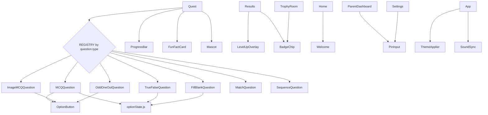

| Group | Components |
|-------|-----------|
| Question renderers | `MCQQuestion`, `TrueFalseQuestion`, `ImageMCQQuestion`, `OddOneOutQuestion`, `FillBlankQuestion`, `MatchQuestion`, `SequenceQuestion` |
| Shared answer UI | `OptionButton`, `optionState.js` (helper) |
| Feedback / delight | `FunFactCard`, `Mascot`, `LevelUpOverlay`, `BadgeChip`, `ProgressBar` |
| Onboarding / input | `Welcome`, `PinInput` |
| Invisible sync | `ThemeApplier`, `SoundSync` |

**Reusable vs screen-specific:** `OptionButton`, `optionState`, `Mascot`, `BadgeChip`, `PinInput`, `ProgressBar` are reusable; the rest are used by one or two screens. The **question registry pattern** (`REGISTRY` object mapping `type → component` in `Quest.jsx`) is the key extensibility seam: adding a question type = add a renderer + one registry entry + a `checkAnswer` case.

---

## 8. State Management

**[VERIFIED]** Single source of truth = `ProgressContext` wrapping one `progress` object, persisted as one `localStorage` key.

| State kind | Where | Example |
|-----------|-------|---------|
| Global durable | `ProgressContext` + `localStorage` | xp, coins, currentDay, streak, badges, ownedItems, settings |
| Screen-local (transient) | `useState` in screens/components | Quest `index/phase/score/streak`, Match `assign`, Shop `flash` |
| Cross-route one-shot | react-router `location.state` | Quest → Results `summary` |
| Refs (non-render) | `useRef` | Quest `startRef`, `lockRef`, `finishedRef`, topic accumulators |

**Persistence:** `localStorage` only. **No** sessionStorage, cookies, IndexedDB, or server DB. **[VERIFIED — `src/game/storage.js`]**

**Source-of-truth rule:** `ProgressContext` mirrors `progress` into a `ref` so `completeQuest`/`updateProgress`/`purchase` compute from the freshest value synchronously and persist via a `useEffect([progress])`. In-quest tallies live locally in `Quest` and are committed **once** at finish through `completeQuest(payload)`.

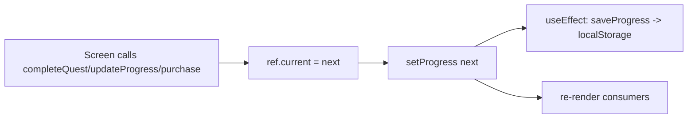

---

## 9. Backend Architecture

**[N/A] There is no backend.** No server process, no request/response lifecycle, no middleware, controllers, services, repositories, or ORM. All "business logic" runs in-browser as pure functions under `src/game/`.

The closest analog to a "service layer" is `src/game/progress.js#applyCompletion()` — a pure reducer `(prevProgress, payload) → { next, summary }`. See §19 and §34.

**[FUTURE]** If a backend is ever added (multi-device sync, second child, notifications), the design note in `CLAUDE.md` recommends a thin cloud layer (e.g. Firebase) behind the existing `storage.js` boundary so the data layer swaps without rewriting screens.

---

## 10. Complete API Documentation

**[N/A] No HTTP API exists.** There are no endpoints, routes, request/response schemas, or status codes. The app makes no `fetch`/`XHR`/WebSocket calls at runtime (verified: no such calls in `src/`). The only network I/O is the browser fetching static assets + Google Fonts.

**Internal "API" (module contracts) that replace a server API:**

| Function | File | Signature | Purpose |
|----------|------|-----------|---------|
| `loadDay(n)` | `game/loadDay.js` | `(number) → Promise<DayData>` | lazy-import a day's JSON chunk |
| `loadMixedQuiz(days,count)` | `game/loadDay.js` | `→ Promise<DayData>` | random practice quiz |
| `applyCompletion(prev,payload)` | `game/progress.js` | `→ {next,summary}` | commit a finished quest |
| `scoreForAnswer({correct,streak,elapsedMs})` | `game/scoring.js` | `→ {points,base,bonus,multiplier}` | per-answer score |
| `evaluateBadges({progress,quest})` | `game/badges.js` | `→ Badge[]` | newly-earned badges |
| `updateStreak(state,today)` | `game/streak.js` | `→ {streak,freezeTokens,usedFreeze}` | streak transition |
| `loadProgress()/saveProgress()` | `game/storage.js` | | persistence |

---

## 11. Database Architecture

**[N/A] No database.** The persistence "schema" is the shape of the single `localStorage` JSON object defined by `defaultProgress()` in `src/game/storage.js`. Treat that object as the app's entire data model.

### 11.1 The one persisted entity — "Progress" (localStorage key `gkquest.progress.v1`)

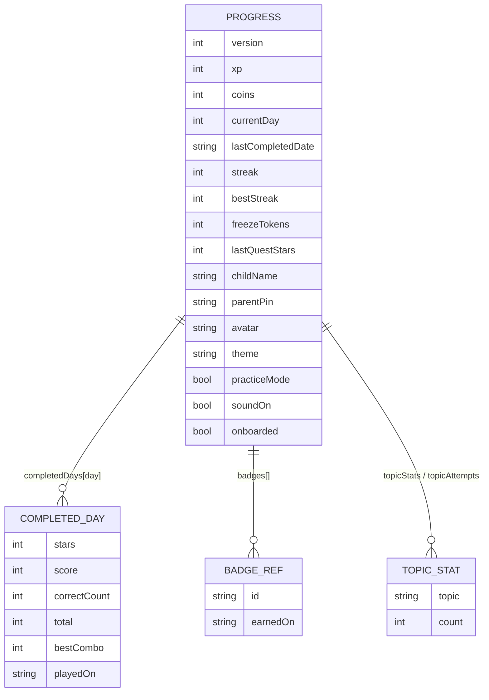

| Field | Type | Meaning | Written by |
|------|------|---------|-----------|
| `version` | int (1) | schema version for migration | `defaultProgress` |
| `xp` | int | permanent score → levels | `applyCompletion` (daily only) |
| `coins` | int | spendable currency | `applyCompletion`, `purchase` |
| `currentDay` | int | next day to attempt (the gate) | `applyCompletion` |
| `lastCompletedDate` | 'YYYY-MM-DD'\|null | last daily quest date | `applyCompletion` |
| `streak` / `bestStreak` | int | consecutive-day streak / record | `applyCompletion` |
| `freezeTokens` | int | streak-freeze count | streak logic, shop, milestones |
| `lastQuestStars` | int\|null | previous quest stars (Comeback Kid) | `applyCompletion` |
| `completedDays` | map day→record | best record per day | `applyCompletion` (`betterRecord`) |
| `topicStats` / `topicAttempts` | map topic→int | correct / attempted per topic | `applyCompletion` |
| `badges` | array `{id,earnedOn}` | earned badges | `applyCompletion` |
| `stats` | `{totalCorrect,totalQuestions,questsPlayed,perfectDays}` | lifetime aggregates | `applyCompletion` (daily only) |
| `childName` | string | certificate + greeting | `Welcome`, `Settings` |
| `parentPin` | string(4) | client PIN | `ParentDashboard`, `Settings` |
| `avatar` / `theme` | string | equipped cosmetics | `Shop` |
| `ownedItems` | string[] | purchased one-time items | `purchase` |
| `practiceMode` | bool | parent-unlocked practice | `ParentDashboard` |
| `soundOn` | bool | mute toggle | `Settings` |
| `onboarded` | bool | first-run done | `Welcome` |

**Indexes / unique keys / transactions:** **[N/A]** (plain JS object). **Migration:** `migrate(saved)` deep-merges missing keys so older saves keep working (`storage.js`).

### 11.2 The content "tables" — static JSON (`src/data/day-*.json`)
Not a database, but the read-only content model. Schema contract in `src/data/schema.md`. See §17.

---

## 12. User Data Model

**[VERIFIED]** There is exactly one implicit "user" (the device owner). The full record is the Progress object in §11. There is no `User`/`Profile`/`Child`/`Parent` entity separation, no IDs, no multi-profile support. **[INFERRED]** "Parent" and "child" are *modes* of the same local record, not separate accounts.

Lifecycle: created by `defaultProgress()` on first load (or when `localStorage` is empty/corrupt) → mutated in place by engine functions → optionally exported/imported/reset by the user.

---

## 13. Authentication

**[N/A] There is no authentication.** No signup, login, OTP, password, OAuth, Firebase Auth, JWT, or session. Anyone with the device/URL has full access to the game.

**Closest mechanism — the "parent PIN":** **[PARTIAL — `ParentDashboard.jsx`, `Settings.jsx`, `PinInput.jsx`]** a 4-digit code stored in **plaintext** in `localStorage.parentPin`, compared client-side to gate the `/parent` route only.

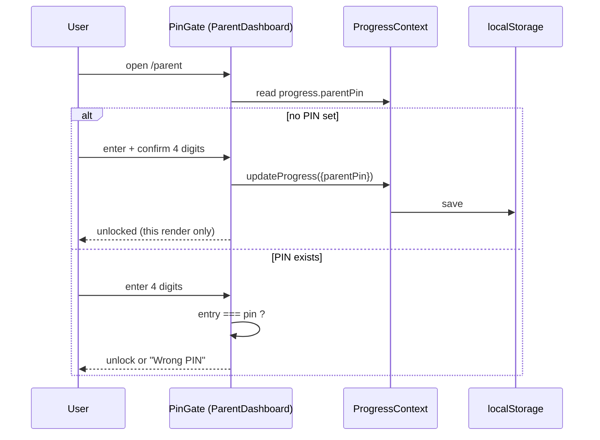

**Security reality:** trivially bypassable (readable/removable via DevTools; `/settings` isn't gated; no lockout). It is a *child deterrent*, not security. **[VERIFIED — see §51].**

Token creation/expiry/refresh, hashing, forgot-password, account deletion: **[N/A]** (only `resetProgress()` clears everything locally).

---

## 14. Authorization / RBAC

**[PARTIAL]** No server-enforced roles. Two informal modes:

| Action | Child | "Parent" (post-PIN) |
|--------|:----:|:----:|
| Play quests / earn rewards | ✅ | ✅ |
| View Trophy Room / Shop | ✅ | ✅ |
| Spend coins | ✅ | ✅ |
| Open Parent Dashboard | 🔒 PIN | ✅ |
| Toggle Practice Mode | 🔒 (via dashboard) | ✅ |
| Change name / sound / PIN (`/settings`) | ⚠️ reachable by URL | ✅ |
| Export / import / **reset** progress | ⚠️ on Home, ungated | ⚠️ |

⚠️ = not actually restricted. Admin / content-manager / super-admin roles: **[N/A].**

---

## 15. Complete User Journey

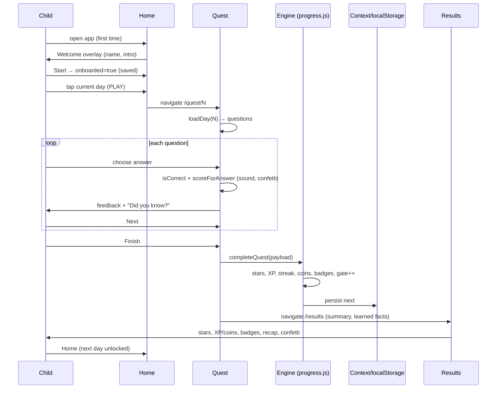

**Backend/data change per step:** all writes are `localStorage` updates via `applyCompletion`. First daily play of day N: `currentDay→N+1`, XP/coins/streak/badges/stats updated. Replays: star record + performance badges only.

---

## 16. Onboarding Architecture

**[VERIFIED — `src/components/Welcome.jsx`]**
- Trigger: `Home` renders `<Welcome/>` while `progress.onboarded` is false.
- Captured: `childName` (optional, ≤20 chars). No email/phone/age/location.
- Actions: "Start" or "Skip" both call `updateProgress({childName, onboarded:true})`.
- Validation: none beyond trim; skip allowed.
- Writes: one `localStorage` update. No API, no analytics.

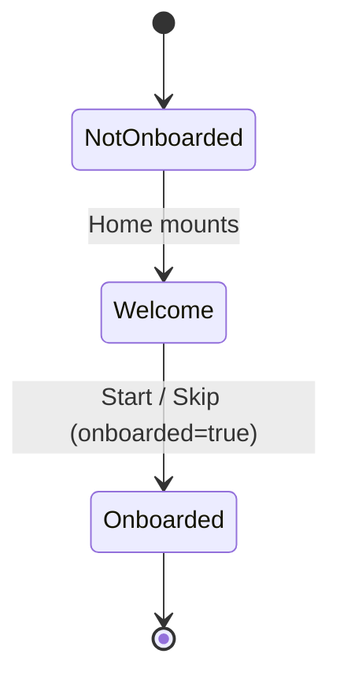

---

## 17. GK Content Architecture

**[VERIFIED — `src/data/schema.md` + files]** Content hierarchy is intentionally flat:

```text
Journey (90 days) → World (3) → Day (JSON file) → Question[] (12 or 15)
```

- `WORLDS` (`game/journey.js`): World 1 Bharat Basics (1–30), World 2 World Explorer (31–60), World 3 Champion's Arena (61–90).
- Special days: `BOSS_DAYS = {7,14,21,28,37,44,51,57,67,74,81}`, `REVIEW_DAYS = {30,60}`, `FINALE_DAY = 90`.
- Each day file: `{ day, world, theme, isBoss, questions[] , (lastUpdated?) }`.

**Content lifecycle:** authored offline (per `CLAUDE.md`, by Claude) → committed as JSON → Vite code-splits each file → lazy-loaded on play. No CMS, no runtime generation, no publish workflow.

### 17.1 Content coverage — a material gap **[VERIFIED]**

| Present | Missing |
|---------|---------|
| Days **1–20** and **68–74** (27 files) | Days **21–67** and **75–90** (63 files) |

The engine references 90 days, but only 27 have content. `Home` guards this: `availableDays()` gates tappability and the CTA shows "Day N coming soon" for missing days. **The 90-day journey is ~30% authored.** Also: only 3 of the special days that require content are covered (7, 14 boss; 74 boss). Day-30/60 reviews, Day-90 finale, and most boss days **have no content yet.**

---

## 18. GK Question System

**[VERIFIED]** 7 types defined & rendered. Field contract per type in `schema.md`. Actual authored distribution across the 27 files:

| Type | Renderer | Count in data | Answer check (`checkAnswer.js`) |
|------|----------|--------------:|---------------------------------|
| `mcq` | `MCQQuestion` | 156 | `response === question.answer` |
| `truefalse` | `TrueFalseQuestion` | 76 | same |
| `fill_blank` | `FillBlankQuestion` | 52 | same (word bank) |
| `odd_one_out` | `OddOneOutQuestion` | 27 | same |
| `match` | `MatchQuestion` | 19 | every `pair.left→right` matches |
| `sequence` | `SequenceQuestion` | 3 | ordered array deep-equals `sequence` |
| `image_mcq` | `ImageMCQQuestion` | **0** | same as mcq (but **no images authored**) |

Per type: DB structure = the JSON fields; rendering = the component; validation = the `checkAnswer` case; scoring = uniform via `scoreForAnswer`; explanation = `funFact` (mandatory); accessibility = see §85. **[CONFIG-UNUSED]:** `image_mcq` renderer + schema exist but no content uses it, and no image assets are tracked in `src/assets/`.

---

## 19. Quiz Engine Architecture

**[VERIFIED — `src/screens/Quest.jsx` + `game/*`]**

```mermaid
sequenceDiagram
    participant Q as Quest.jsx
    participant L as loadDay.js
    participant CA as checkAnswer.js
    participant SC as scoring.js
    participant PR as progress.js
    participant CTX as ProgressContext
    Q->>L: loadDay(N) / loadMixedQuiz(days)
    L-->>Q: {day, theme, isBoss, questions[]}
    Q->>Q: startRef = performance.now()
    loop per question (index)
      Q->>CA: isCorrect(question, response)
      Q->>SC: scoreForAnswer({correct, streak+1, elapsedMs})
      Q->>Q: update score/correctCount/streak; play sound; confetti if x3
      Q->>Q: phase='feedback'; show FunFact; scroll Next into view
    end
    Q->>PR: completeQuest(payload)  %% only on last question
    PR->>PR: applyCompletion → stars/xp/streak/coins/badges
    PR->>CTX: persist; return summary
    Q->>Q: navigate('/results', {summary, theme, learned})
```

**Selection/randomisation:** normal day = the file's fixed question order. Practice = `loadMixedQuiz` pulls questions across completed days, `shuffle`s, slices `count` (default 12). Match/Sequence shuffle their options client-side (`shuffle`/`shuffleUnless`). **[VERIFIED]**

**Timer/speed:** `startRef` per question; `elapsedMs` feeds `speedBonus` (full 50 at 0 ms, linear to 0 at 8000 ms). **No countdown/time limit** — "rapid fire" as a distinct timed mode is **[N/A]** (not implemented; speed only affects bonus).

**Guards:** `lockRef` (one answer per question), `finishedRef` (no double-finish), `Math.min` index clamp, `phase` checks. **[VERIFIED]**

**Retries:** replaying a past day is allowed (practice); keeps best stars via `betterRecord`. **Progress save:** only at finish, atomically via `completeQuest`.

---

## 20. Difficulty / Level System

**[PARTIAL]** Two distinct notions:
- **Question difficulty:** each question has `difficulty: easy|medium|hard` (metadata). **[CONFIG-UNUSED at runtime]** — it is authored guidance only; the engine does **not** read `difficulty` for selection, scoring, or adaptation.
- **Player level (rank):** `game/levels.js` — 9 ranks by XP thresholds `0/300/800/1600/2800/4500/7000/10000/14000`. `levelForXp(xp)` returns rank + progress to next. **[VERIFIED]**

No adaptive difficulty, no advancement logic beyond XP. **[N/A]** for adaptivity.

---

## 21. Personalization Engine

**[PARTIAL / mostly N/A]** No algorithmic personalization/recommendation. The only per-child tailoring:
- `childName` (greeting + certificate).
- Cosmetics (avatar/theme).
- Parent Dashboard surfaces **strongest/weakest topics** by accuracy (`topicAttempts`/`topicStats`, ≥3 attempts) — **descriptive analytics, not a recommender.** **[VERIFIED — `ParentDashboard.jsx`]**

There is **no** input pipeline using age/grade/history to choose next content, and no next-best-action engine. **[N/A]** ("personalization" in the marketing sense = the content itself was hand-curated for one child, not computed at runtime.)

---

## 22. AI Architecture

**[N/A] There is no AI/LLM in the running app.** No provider SDKs, no prompts executed at runtime, no model calls, no generation/tutor/chat/translation/voice/image/video features in `src/`.

**Where AI actually lives:** **offline authoring.** Per `CLAUDE.md`, question JSON is *generated by Claude during development* against `schema.md`, then committed. This is a build-time/human-in-the-loop content process, entirely outside the shipped app. Consequently every AI sub-topic the generic prompt requests (triggers, prompt templates in-repo, model params, output parsing, retry/fallback, cost, runtime safety) is **[N/A]** at runtime.

- Prompt templates in the repo: **none** (`schema.md` is a content contract, not an executable prompt). **[VERIFIED]**
- The marketing-video generation (Kling/Higgsfield via MCP) happened in the dev session and is **not** part of the product. **[INFERRED]**

---

## 23. Complete AI Data Flow
**[N/A]** — no runtime AI path exists. Offline authoring flow (for completeness):

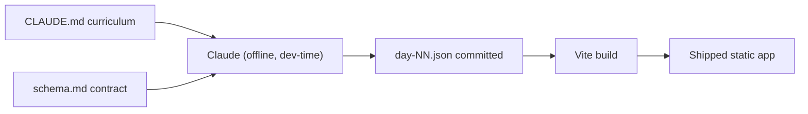

---

## 24. AI Prompt Architecture
**[N/A]** No prompts stored or executed in the repository. Prompt inventory: empty.

---

## 25. AI Safety for Children

**[N/A] at runtime** (no AI to constrain live). **[IMPORTANT — process control, not code]:** child-safety is enforced by the **authoring contract** in `schema.md` + `CLAUDE.md`: age-appropriate language, factually true `funFact` (mandatory), unambiguous answers, India-first, "(as of YYYY)" tags for office-holders, and a stated cadence to re-verify/regenerate stale current-affairs files (68–74, 72). There is **no runtime moderation/PII/injection surface** because there is no user free-text input or model call. The residual risk is **content correctness**, addressed by human authoring + the schema rules, not by software. See §27. **[VERIFIED — schema.md, CLAUDE.md]**

---

## 26. Content Generation Pipeline
**[PARTIAL — human/offline]**

```text
Curriculum (CLAUDE.md) → Claude drafts JSON to schema.md → (human review) → commit → Vite code-split → user plays
```
No automated schema-validation gate, factual-validation, duplicate-check, or publish workflow exists in code. Validation is by convention (`schema.md`) + author judgment. **[FUTURE]** add a JSON-schema/CI validator (see §63/§100).

---

## 27. Factual Accuracy System

**[VERIFIED — process only]** For a GK app, correctness is mission-critical. Today it relies on:
- Authoring rules in `schema.md` (facts must be true, unambiguous; `funFact` mandatory).
- `lastUpdated` on current-affairs files (68–74, day-72) — all currently `2026-07-26` — with a documented "regenerate every couple of months" cadence and "(as of YYYY)" phrasing.

There is **no** runtime fact-checking, source URLs, RAG, knowledge base, cross-model validation, or confidence scoring. **[RISK]** stale current-affairs content is a known, dated risk (see §72/§73). This is acceptable for a single-child app but must be flagged for any wider release.

---

## 28. Search Architecture
**[N/A]** No search feature (no search UI, index, or query path).

## 29. Audio Architecture
**[VERIFIED — `src/game/sound.js`]** Synthesized SFX via the **Web Audio API** — no audio files (keeps it tiny + offline). 4 cues: `correct`, `wrong`, `coin`, `levelup`, built from oscillator notes. Respects mute (`enabled`, synced by `SoundSync` from `progress.soundOn`). Lazy `AudioContext`, resumes on demand, fails silently. No TTS/STT, no recording, no permissions needed.

## 30. Video Architecture
**[N/A] in-app.** No video playback/generation in the product. `promo/*.html` are **marketing** end-cards (not shipped). The 4K ad clips were generated externally during dev.

## 31. Image Architecture
**[PARTIAL]** App icons/favicon in `public/` (`favicon.svg`, `apple-touch-icon.png`, `icon-192/512.png`). `ImageMCQQuestion` supports `question.image` (asset path or URL) with an emoji placeholder fallback, but **no image questions or image assets exist** (`src/assets/` holds only a README). No upload pipeline, optimization, or CDN. Emoji are used pervasively in place of raster art. **[VERIFIED]**

---

## 32. Gamification Architecture

**[VERIFIED]** The richest part of the app. Mechanics and where they live:

| Mechanic | Earning rule | State field(s) | Logic file |
|----------|-------------|----------------|-----------|
| XP | per-answer points summed → committed as quest XP (daily only) | `xp` | `scoring.js`, `progress.js` |
| Coins | `5 × correct + star bonus + streak-milestone bonus` | `coins` | `scoring.js`, `progress.js` |
| Stars (per quest) | ≥90%→3, ≥60%→2, else 1 (min 1) | `completedDays[d].stars` | `scoring.js#starsForResult` |
| Combo multiplier | streak≥5→×3, ≥3→×2, else ×1 (within a quest) | transient `streak` | `scoring.js#comboMultiplier` |
| Speed bonus | up to +50, linear over 8 s window | transient | `scoring.js#speedBonus` |
| Levels (9 ranks) | XP thresholds | derived from `xp` | `levels.js` |
| Streak (days) | +1/day; freeze forgives 1 miss | `streak/bestStreak/freezeTokens` | `streak.js` |
| Badges (20) | see §32.1 | `badges[]` | `badges.js` |
| Certificate | Day 90 complete | derived | `certificate.js` |
| Shop cosmetics | spend coins | `ownedItems/avatar/theme` | `shop.js`, `ProgressContext#purchase` |

**Abuse prevention:** minimal — client-only, so all values are user-editable via DevTools/import. Replays grant no XP/coins/streak (practice), which prevents *in-app* grinding, but not tampering. **[VERIFIED]**

### 32.1 Badge catalog (20 badges, 4 groups) — `game/badges.js`
- **Topic Mastery (7):** capital_king, science_star, space_cadet, nature_ranger, history_hero, sports_champ, current_affairs_ace (threshold sums over topic tags).
- **Performance (3):** perfect_score, speed_demon (≥90% + ≥70% fast), comeback_kid (3★ right after a ≤1★ day).
- **Consistency (9):** streak_3/7/14/30/60/90 (by `bestStreak`) + month_1/2/3 (all days in a world).
- **Grand (1):** champion_trophy (all 90 days).

`evaluateBadges` awards any not-yet-owned badge whose `check(ctx)` is true, on every quest completion (daily and replay).

---

## 33. Streak System

**[VERIFIED — `game/streak.js`, `game/dates.js`]**
- `updateStreak({streak,lastDate,freezeTokens}, today)`:
  - no `lastDate` → streak = 1
  - `dayDiff ≤ 0` (same day) → unchanged
  - `dayDiff === 1` → +1
  - `dayDiff === 2` **and** a freeze token → +1, consume token (`usedFreeze`)
  - otherwise → reset to 1
- Milestones `[3,7,14,30,60,90]` grant coin bonuses `{3:20,7:50,14:75,30:150,60:300,90:500}`; freeze token awarded at `{7,30,60}`.
- **Timezone/day boundary:** local device time via `todayStr()` (`YYYY-MM-DD` from `new Date()`), diff via midnight-anchored `Date`. **[VERIFIED — see §89 for the local-time caveat].**

---

## 34. XP / Coin Engine

**[VERIFIED — `game/scoring.js`, `game/progress.js`]**
```text
per correct answer: points = (BASE 100 + speedBonus[0..50]) × comboMultiplier[1|2|3]
wrong answer:       points = 0, streak resets to 0
quest XP (daily):   xp = Σ points        → next.xp = prev.xp + xp
coins (daily):      5 × correctCount + STAR_COIN_BONUS[stars] + streakMilestone.coinBonus
stars:              starsForResult(correctCount, total)  (min 1 on completion)
```
Committed only when `day === currentDay` (first daily play). Replays: `xpEarned=0, coinsEarned=0`. Functions: `scoreForAnswer`, `starsForResult`, `applyCompletion`.

---

## 35. Leaderboard Architecture
**[N/A]** No leaderboard (single-user, offline). No ranking/scope/cache/privacy concerns. **[FUTURE]** would require a backend.

---

## 36. Progress Tracking

**[VERIFIED]** Definitions:
- **Day completed:** an entry exists in `completedDays[day]` (best-of record).
- **Quest played (daily):** increments `stats.questsPlayed`, `stats.totalQuestions/totalCorrect`, `perfectDays` if 100%.
- **World/month progress:** derived counts (`Home`, badges `countCompletedInRange`).
- **Rank progress:** `levelForXp(xp).progress` (0..1).
No per-topic "mastery %" beyond dashboard accuracy; no "lesson" concept (there are no lessons, only quizzes).

---

## 37. Recommendation / Next-Best-Action
**[N/A]** None. Next day is simply `currentDay`; the app never recommends topics/revision. See §21.

---

## 38. Analytics Architecture
**[N/A]** No analytics provider, event taxonomy, or tracking calls anywhere. Zero telemetry leaves the device. (This is privacy-positive but means **no usage/funnel/retention data exists** — see §39/§50.) **[FUTURE]** a privacy-respecting, parent-consented analytics layer if the app is distributed.

## 39. User Funnel
**[N/A]** Not instrumented. Install→signup→D1→D7 cannot be measured (no accounts, no analytics). Flag: **entire funnel is dark.**

## 40. Notification Architecture
**[N/A]** No push/email/SMS/WhatsApp/in-app notifications. The PWA manifest doesn't request notifications; no service-worker push handlers. The "daily habit" relies on the user opening the app. **[FUTURE]** local notifications/reminders would need SW push + permissions (+ ideally a backend for scheduling).

---

## 41. Daily Content / Daily Challenge

**[PARTIAL]** "Daily" = one unlock step, not a date-scheduled challenge.
- The **gate**: `canStartDay` allows the current day + replays of past days; **the once-per-day lock was intentionally removed** — the child may play unlimited quizzes/day (comment in `progress.js`). Each *new* day still unlocks the next; the streak still counts once per calendar day (`updateStreak` `diff<=0` no-op).
- "Today" is derived from local date only for streaks, not for content selection. No scheduling/expiry/reset of content. Boss/review/finale are fixed day numbers, not calendar events. **[VERIFIED]**

---

## 42. Admin Panel
**[N/A]** No admin app/screens/API. Content is edited by changing JSON files in the repo.

## 43. CMS / Content Management
**[N/A]** No CMS. Create/edit/publish = git edits to `src/data/*.json`. Permissions = repo access. **[FUTURE]** a JSON-schema-validated authoring UI or headless CMS if content scales.

## 44. File Storage
**[N/A]** No uploads. Two client-generated downloads exist (Blob → `<a download>`): progress export JSON (`Home`) and certificate PNG (`certificate.js`). No server storage/MIME validation/CDN.

---

## 45. Caching Strategy

**[VERIFIED — `vite.config.js`]**
- **Service worker (Workbox) precache:** `globPatterns: **/*.{js,css,html,svg,png,json,woff2}` → the entire app shell **and every code-split day chunk** are precached → full offline after first load. `navigateFallback: /index.html`. `registerType: autoUpdate`.
- **Runtime cache:** Google Fonts (`fonts.googleapis.com`/`fonts.gstatic.com`) → `StaleWhileRevalidate`, cache `google-fonts`.
- **HTTP caching:** whatever the static host sets (Vite content-hashes filenames → safe long-term caching). **[INFERRED]**
- No Redis/server cache/react-query cache (**[N/A]**).

## 46. Performance Architecture

**[VERIFIED / INFERRED]**
- **Code splitting:** each `day-*.json` is a separate lazy chunk via `import.meta.glob` → only the played day is fetched (verified in `dist/assets/` — 27 `day-NN-*.js` chunks + one app `index` JS/CSS).
- **Bundle:** small dependency set; no heavy libs. Main `index` JS + one CSS.
- **Images:** essentially none (emoji) → negligible image weight; no CLS from images.
- **Potential bottlenecks:** Framer Motion animations on low-end devices; confetti bursts; `Home` renders 90 animated nodes (light). No N+1/DB/AI latency concerns (none exist).
- **[FUTURE]** consider `React.lazy` for route-level screens (currently all screens import eagerly in `App.jsx`).

---

## 47. Error Handling

**[VERIFIED]**
- **Content load:** `Quest` try/catches `loadDay` → friendly error card + Home button; `loadDay` throws a clear message for missing files.
- **Persistence:** `storage.js` wraps `localStorage` get/set in try/catch → falls back to defaults / in-memory (no crash if storage is full/blocked).
- **Import:** `parseImported` throws on junk; `Home` shows the message.
- **Missing route state:** `Results` redirects home if no `summary`.
- **No global ErrorBoundary** — an unexpected render error would white-screen. **[GAP — see §73].**
- Sound/confetti failures are swallowed intentionally.
There is no structured error schema (no API). **[N/A]** for API error contracts.

## 48. Retry Strategy
**[PARTIAL]** Only `loadMixedQuiz` tolerates a failed day load (`.catch(()=>null)` then filters). No retry/backoff for anything else (nothing else is async/networked). `shuffleUnless` "retries" up to 8 times to avoid a pre-solved sequence. **[N/A]** for network retries.

## 49. Logging
**[PARTIAL]** No logging framework; a few silent `catch {}` blocks. No request/security/AI logs (none apply). Nothing sensitive is logged (nothing is logged). **[FUTURE]** add opt-in client error logging (guard PII: the only PII is `childName`).

## 50. Observability
**[N/A]** No uptime/error/latency/crash monitoring or analytics. The app is unobserved in production by design. **Gap for any real launch.**

---

## 51. Security Architecture

**[VERIFIED — review of a client-only app]**

| Area | Status | Notes |
|------|--------|-------|
| AuthN/AuthZ | **[PARTIAL]** | client PIN only; bypassable; `/settings` ungated |
| Input validation | **[PARTIAL]** | PIN regex `^\d{4}$`; import validates `xp` is a number; name length-capped; answers are constrained taps |
| XSS | **[LOW RISK]** | React escapes by default; **no `dangerouslySetInnerHTML`** anywhere; all content is static JSON authored in-repo |
| Injection (SQL/NoSQL) | **[N/A]** | no DB/queries |
| CSRF | **[N/A]** | no server/cookies/session |
| CORS | **[N/A]** | no cross-origin API |
| Secrets / API keys | **[VERIFIED — none]** | no `.env`, no keys anywhere in `src/`; nothing to leak (the client-side `parentPin` is user data, not a secret) |
| Transport | host-dependent | serve over HTTPS (Netlify/Vercel default) |
| Rate limiting | **[N/A]** | no server |
| Prompt injection | **[N/A]** | no LLM, no free-text input |
| Dependency risk | **[LOW]** | small, well-known deps; no lockfile audit run here |

**Top security truth:** the threat model is "a child (or curious user) editing their own local save." There is **no** attacker-reachable server or secret. The client PIN is a deterrent, not a control.

⚠️ **[VERIFIED FINDING]** The Claude Code dev-permission file `.claude/settings.local.json` contains **pre-signed S3 upload URLs (with `X-Amz-Security-Token`)** used during the marketing-video work. These are time-limited (24 h `X-Amz-Expires=86400`, now expired) but are **committed to the repo**. They are not app secrets and grant no lasting access, but this file should be git-ignored / cleaned. See §53/§73.

## 52. Environment Variables
**[VERIFIED — none]** The app reads **zero** environment variables. No `import.meta.env.*` usage in `src/`, no `.env` file (and `.env`/`*.local` are git-ignored).

| Variable | Purpose | Used by | Required | Secret |
|----------|---------|---------|----------|--------|
| — | (none) | — | — | — |

## 53. Secrets Management
**[VERIFIED]** No app secrets exist (nothing to manage). `.gitignore` excludes `.env`/`*.local`. **Action:** the expired pre-signed URLs and MCP command history in `.claude/settings.local.json` should not be committed — add `.claude/settings.local.json` to `.gitignore` and scrub it. No hard-coded API keys were found in `src/`.

---

## 54. Privacy Architecture

**[VERIFIED]** Minimal data, all local:

| Data | Why | Where stored | Who can access | Retention | Deletion |
|------|-----|--------------|----------------|-----------|----------|
| `childName` (optional) | greeting + certificate | `localStorage` | device owner | until reset/cleared | `resetProgress` / clear storage |
| `parentPin` (4 digits) | gate parent area | `localStorage` (plaintext) | device owner | same | same |
| Progress/stats | gameplay | `localStorage` | device owner | same | same |

**No data leaves the device.** No PII transmitted, no third-party trackers, no cookies. Export produces a local JSON file the user controls. Strong default privacy posture.

## 55. Child Safety / Compliance

**[VERIFIED / assessment]**
- No accounts, no chat, no user-generated content, no public profile, no data collection/transmission → the usual COPPA/GDPR-K data surfaces are largely **absent**.
- `parentPin` gates the parent area (weak). Content safety is via authoring rules (§25).
- **Do not claim legal compliance.** For distribution beyond one family, a legal review is warranted on: local storage of a child's name, absence of verifiable parental consent flows, and content-accuracy liability. **[FLAG for legal review, not a code defect.]**

## 56. Rate Limiting / Abuse Prevention
**[N/A server-side].** In-app: replays grant no rewards; one-answer/one-finish locks prevent double-scoring. Local tampering is unpreventable in a client-only app. **[VERIFIED]**

---

## 57. Deployment Architecture

**[VERIFIED — `README.md`, `public/_redirects`, `dist/`]**

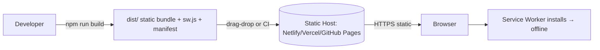
- Build: `vite build` → `dist/` containing `index.html`, hashed `assets/*` (app + 27 day chunks), `sw.js`, `workbox-*.js`, `registerSW.js`, `manifest.webmanifest`, icons, `_redirects`.
- SPA routing on host: `_redirects` (`/* /index.html 200`) for Netlify; Vercel auto-handles; other hosts need equivalent rewrite. **[VERIFIED]**
- No CI/CD pipeline in repo; deploy is manual drag-drop of `dist/` (documented). **[VERIFIED]**

## 58. Local Development Setup
**[VERIFIED — `package.json`, `README.md`]**
```bash
# Requires Node 18+
npm install        # install deps
npm run dev        # Vite dev server → http://localhost:5173
npm run build      # production build → dist/ (includes service worker)
npm run preview    # serve dist/ locally to test PWA/offline
```
No DB, no env file, no seed step. Service worker only runs in the built app (`build`+`preview`), not `dev`. First launch shows the Welcome overlay.

## 59. Environments
**[PARTIAL]** Only **local** and **production (static host)** exist. No staging/dev environments, no environment-specific config (there are no env vars). **[VERIFIED]**

## 60. Docker Architecture
**[N/A]** No Dockerfile/compose. Not needed for a static SPA.

## 61. CI/CD
**[N/A]** No GitHub Actions or other CI config in repo. **[FUTURE]** a minimal pipeline: install → build → (lint/tests once added) → deploy `dist/`.

## 62. Git / Branching Model
**[INFERRED]** The working directory is **not currently a git repository** (no `.git/` initialized in this environment), though `.gitignore` exists (authored for eventual VCS). No branch history to inspect. **[FUTURE]** `main` + short-lived `feature/*`/`fix/*`; protect `main`; conventional commits.

---

## 63. Testing Architecture
**[N/A — none present]** No test files, no test runner (`vitest`/`jest`), no component/E2E tooling (`@testing-library`/Playwright/Cypress) in `package.json` or repo.

> Note: an ad-hoc Node script (`gametest.mjs`) was used during development (referenced in `.claude/settings.local.json`) to sanity-check the engine, but it is not committed to the repo and is not a test suite.

## 64. Test Coverage Matrix
**[N/A]** Current coverage = **0%**. Target once added:

| Module | Unit | Integration | E2E | Current | Gap |
|--------|:---:|:---:|:---:|:---:|-----|
| `scoring.js` | ✅ target | — | — | none | high value, pure fn |
| `streak.js` | ✅ | — | — | none | timezone edge cases |
| `progress.js#applyCompletion` | ✅ | — | — | none | core reducer |
| `badges.js` | ✅ | — | — | none | 20 checks |
| `checkAnswer.js` | ✅ | — | — | none | all 7 types |
| Quest flow | — | ✅ | ✅ | none | answer→finish→results |
| Content JSON | — | ✅ (schema) | — | none | validate all files |

## 65. AI Testing
**[N/A]** No runtime AI to test. The relevant equivalent is **content validation** (schema conformance, answer-in-options, `funFact` present, `lastUpdated` freshness) — recommended as CI checks. **[FUTURE]**

## 66. Database Backup / Recovery
**[PARTIAL]** No DB, but the user-facing analog exists: **Export/Import progress** (JSON) on Home, and `resetProgress`. That is the entire backup/restore story — manual, user-driven, per-device. No automated backup, RPO/RTO **[N/A]**.

## 67. Failure Scenarios
**[VERIFIED behavior]**

| Scenario | Behavior |
|----------|----------|
| Offline after first load | Fully works (SW precache) incl. all day content |
| Offline on very first load (never cached) | App shell won't load (nothing cached yet) |
| Fonts CDN unreachable | Falls back to `system-ui` (Tailwind stack) |
| `localStorage` blocked/full | `storage.js` catches → in-memory play, no persistence |
| Corrupt save | `loadProgress` catch → `defaultProgress` |
| Missing day file | `loadDay` throws → friendly error card |
| Backend/DB/AI/auth down | **[N/A]** — none exist |
| Unhandled render error | **white screen (no ErrorBoundary)** |

---

## 68. Scalability
**[INFERRED — architectural analysis, not current behavior]** A static SPA scales with the CDN. There is no shared server state, so **1K→1M DAU is a CDN/bandwidth concern only** (each user is independent, offline after first load). No DB connections/AI concurrency/queues to scale. The scaling limits are: (a) content authoring throughput, (b) CDN egress cost, (c) the *product* limits of a single-device, no-sync model (no cross-device continuity, no cohorts). **[FUTURE]** multi-device/second-child needs a backend.

## 69. Cost Architecture
**[INFERRED]** Essentially free to run.

| Component | Cost driver | Usage driver | Optimization |
|-----------|-------------|--------------|--------------|
| Static hosting/CDN | egress + requests | DAU × asset size | free tiers (Netlify/Vercel/Pages); content-hash caching |
| Google Fonts | free | first load | already runtime-cached; could self-host to remove the dependency |
| AI/TTS/STT/video/DB/storage | **[N/A]** | — | none used |

No vendor pricing invented — there are no paid services in the runtime.

## 70. Third-Party Dependency Matrix

| Service | Purpose | Integration | Failure impact | Secret |
|---------|---------|-------------|----------------|--------|
| Static host (Netlify/Vercel/Pages) | serve files | deploy `dist/` | app unreachable | none |
| Google Fonts | display fonts | `<link>` + SW cache | fonts fall back to system | none |
| (dev-only) Higgsfield/MCP media | marketing video | outside app | none on app | expired presigned URLs in `.claude/` |

Only **two** runtime third parties, both non-critical.

## 71. Package Dependency Review
**[VERIFIED]**
- **Critical:** react, react-dom, react-router-dom, vite, tailwindcss.
- **Security-sensitive:** none handle secrets/PII/network beyond static assets.
- **Obsolete/unused:** none obvious in `dependencies`; no duplicate UI libs.
- **Notable absence:** no TypeScript, no test libs, no lint config (`eslint`/`prettier` not in `package.json`), though code contains `eslint-disable` comments implying an expectation of ESLint. **[GAP]**
- Do not auto-upgrade; versions are recent and consistent.

---

## 72. Technical Debt Register

| Pri | Issue | Evidence | Impact | Recommendation | Effort |
|-----|-------|----------|--------|----------------|--------|
| **P0** | Content only 30% authored (27/90 days) | `src/data/` | Journey can't be finished; badges/finale unreachable | Author days 21–67, 75–90 (+ boss/review/finale content) | High |
| **P0** | Current-affairs freshness | `lastUpdated=2026-07-26` on 68–74 | Facts go stale → wrong answers | Regenerate + re-verify office-holders; add a CI freshness check | Med (recurring) |
| **P1** | No tests | no runner/files | Regressions in scoring/streak/badges go unnoticed | Add Vitest unit tests for `game/*` (pure fns) | Med |
| **P1** | No ErrorBoundary | `App.jsx` | Any render error → white screen | Wrap `<Routes>` in an ErrorBoundary with a friendly fallback | Low |
| **P1** | `.claude/settings.local.json` committed w/ presigned URLs | that file | Repo hygiene / leakage optics | git-ignore + scrub | Low |
| **P2** | `/settings` not PIN-gated | `App.jsx`, `Settings.jsx` | Child can change name/PIN/sound | Gate `/settings` behind the same PIN, or route only via unlocked dashboard | Low |
| **P2** | `image_mcq` unused; no art | data + `src/assets` | Feature dormant | Add image questions/assets or drop the type | Low |
| **P2** | No ESLint/Prettier config | `package.json` | Inconsistency risk; `eslint-disable` no-ops | Add configs + `lint` script | Low |
| **P3** | Dead CSS (`.btn-answer`, `.btn-success`) | `index.css` | Minor bloat/confusion | Remove or adopt | Low |
| **P3** | Screens imported eagerly | `App.jsx` | Slightly larger initial JS | `React.lazy` per route | Low |

## 73. Architectural Risks

| Risk | Evidence | Severity |
|------|----------|----------|
| Content incompleteness blocks the core promise (90-day journey) | 63 missing day files | **High** |
| Stale factual content (no runtime verification) | dated `lastUpdated`, no fact-check | **High** (for wider release) |
| All state client-side & tamperable; no backup redundancy | `localStorage` only | **Med** (fine for 1 child) |
| No error boundary / no monitoring → silent failures | §47/§50 | **Med** |
| Weak parent gate (plaintext PIN, `/settings` open) | §13/§14 | **Low–Med** |
| First-load requires network (PWA can't cold-start offline) | SW model | **Low** |
| Single point of authoring (no schema CI) → malformed JSON crashes a day | no validator | **Low–Med** |

## 74. Code Quality Review
**[VERIFIED]** Strong for its size:
- **Separation of concerns:** excellent — pure logic in `game/`, UI in `components/`/`screens/`, persistence isolated in `storage.js`.
- **Naming/readability:** clear, well-commented (design intent captured in comments).
- **Duplication:** low; question renderers share `OptionButton`/`optionState`.
- **Type safety:** none (plain JS) — the main maintainability risk; the JSON `schema.md` is the only "type" contract, unenforced.
- **Testability:** high (pure functions) but untested.
- **Extensibility:** the question `REGISTRY` + badge/shop/journey arrays are clean extension points.
- **Error handling:** defensive around storage/content; missing a global boundary.

---

## 75. Current vs Ideal Architecture

**Current (as-is):**
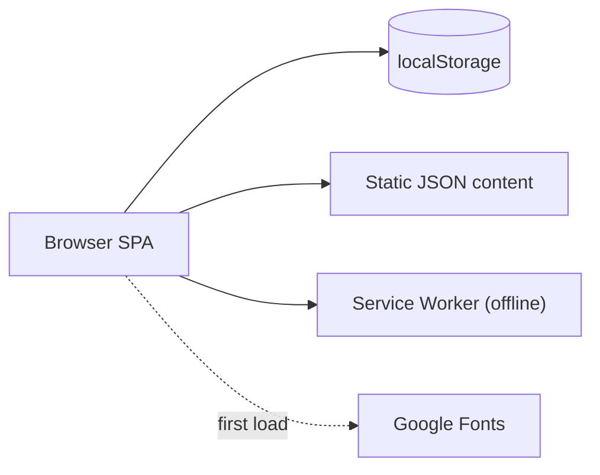

**Recommended future (only if the product expands beyond one child):**
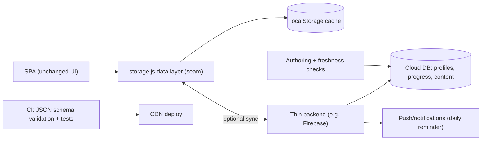
**Difference to keep obvious:** everything in "future" beyond the SPA + `storage.js` seam is **[FUTURE]** and does **not** exist today.

## 76. Architecture Decision Records (inferred)

- **ADR-001 — Client-only, no backend.** *Decision:* ship a static PWA with `localStorage`. *Why (inferred + `CLAUDE.md`):* free hosting, zero ops, privacy, one user. *Trade-offs:* no sync/leaderboard/analytics/notifications; tamperable. *Alternative:* Firebase. *Status:* Active. *[INFERRED reasoning]*
- **ADR-002 — JavaScript, not TypeScript.** *Why:* simplicity/speed for a solo build (`CLAUDE.md` "Keep it simple (JS, no TS)"). *Trade-off:* no compile-time safety. *Status:* Active. *[VERIFIED intent]*
- **ADR-003 — Content as per-day JSON, code-split.** *Why:* easy to edit/regenerate; load only what's played. *Trade-off:* no CMS; manual validation. *Status:* Active. *[VERIFIED]*
- **ADR-004 — Synthesized audio (Web Audio), no files.** *Why:* tiny + offline. *Trade-off:* simple sounds only. *Status:* Active. *[VERIFIED]*
- **ADR-005 — No `React.StrictMode`.** *Why:* avoid Framer Motion double-mount animation glitches. *Trade-off:* loses StrictMode checks. *Status:* Active. *[VERIFIED — comment].*
- **ADR-006 — Removed once-per-day gate.** *Why:* allow unlimited quizzes/day. *Trade-off:* "daily" habit less enforced (streak still daily). *Status:* Active. *[VERIFIED — comment].*

---

## 77–78. Data-Flow & Sequence Diagrams (implemented flows only)

**Answer a question (deep trace):**
```mermaid
sequenceDiagram
    participant UI as OptionButton
    participant Q as Quest.handleAnswer
    participant CA as checkAnswer.isCorrect
    participant SC as scoring.scoreForAnswer
    participant SND as sound.play
    UI->>Q: onAnswer(response)
    Q->>Q: lockRef guard; elapsedMs = now - startRef
    Q->>CA: isCorrect(question, response)
    CA-->>Q: bool
    Q->>SC: scoreForAnswer({correct, streak+1, elapsedMs})
    SC-->>Q: {points, base, bonus, multiplier}
    Q->>SND: play(correct?'correct':'wrong')
    Q->>Q: setScore/correctCount/streak; refs; phase='feedback'
    Q-->>UI: feedback banner + FunFactCard + Next
```

**Complete quest → persist (deep trace):**
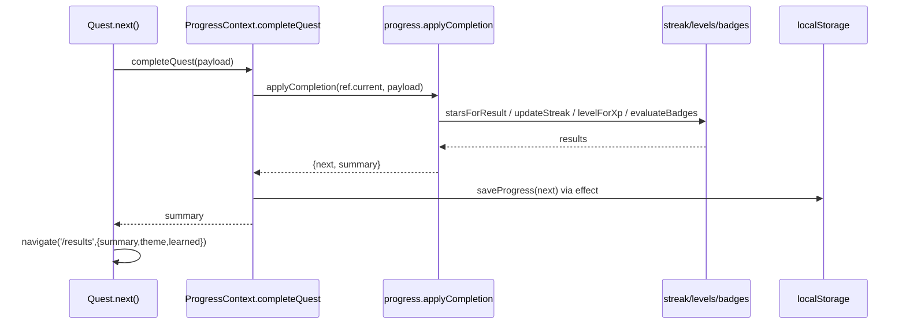

**Purchase (shop):** `Shop.buy → ProgressContext.purchase(item)` → checks owned/coins → deduct coins, add token or `ownedItems` → persist → `flash` feedback. **[VERIFIED]**

**Onboarding / theme / sound:** `Welcome.start → updateProgress`; `ThemeApplier`/`SoundSync` effects mirror `theme`/`soundOn`.

---

## 79. Data Lifecycle
Progress: `defaultProgress()` (create) → engine mutations (update) → export/import (move) → `resetProgress` (delete). No archival. **[VERIFIED]**

## 80. Content Lifecycle
Curriculum → author JSON to `schema.md` → commit → Vite chunk → play → (manual) update/regenerate (esp. current-affairs). No automated review/retire. **[VERIFIED/PARTIAL]**

## 81. User Lifecycle
Onboarding → active play → (dormant if unopened) → reactivate by opening → delete via reset. No server-tracked states, no reactivation nudges (no notifications). **[VERIFIED/PARTIAL]**

## 82. Configuration Architecture
**[VERIFIED]** Config lives as **module constants**, not env/remote:
`levels.RANKS`, `scoring.*` constants, `streak.*` milestones, `journey.*` (worlds/boss/review/finale), `shop.*` catalogs, `badges.BADGES`, Tailwind theme, PWA manifest. All build-time. No runtime/remote config.

## 83. Feature Flags
**[N/A]** No flag system. The only runtime toggles are user settings (`practiceMode`, `soundOn`). **[FUTURE]** trivial to add a small config module if needed.

## 84. Internationalization
**[N/A]** English-only, hard-coded strings. No i18n framework, locale detection, RTL, or translation files. (Content is India-centric English.)

## 85. Accessibility
**[PARTIAL — VERIFIED]** Good touch ergonomics; some a11y:
- `aria-label` on icon buttons/nav/toggles; `aria-pressed` on toggles; `aria-hidden` on decorative emoji/mascot; semantic headings; large ≥48–64px targets; `alt` on images.
- Gaps: heavy emoji-as-content (screen-reader verbosity), colour-coded correctness without a non-colour cue for some states, no visible focus-ring styling, no keyboard-first testing, motion-heavy (partly mitigated by `disableForReducedMotion` on confetti, but Framer Motion transitions aren't gated on `prefers-reduced-motion`). **[FUTURE]** audit + `prefers-reduced-motion`.

## 86. Responsive Design
**[VERIFIED]** Phone-first. `max-w-[30rem]` content cap; fluid type (`clamp`); `100dvh` with `100vh` fallback; safe-area insets (`env(safe-area-inset-*)`, `viewport-fit=cover`); `overflow-x:hidden` guards; grid-based journey that never overflows. Tailwind `sm:` used sparingly. Works desktop→mobile; optimized for mobile/PWA.

## 87. PWA / Mobile Architecture
**[VERIFIED — `vite.config.js`, `index.html`]**
- **Manifest:** name/short_name "GK Quest", `display: standalone`, `orientation: portrait`, `theme/background #7c3aed`, icons 192/512 (+ maskable), `start_url /`.
- **Service worker:** Workbox precache (app shell + all day chunks) + Google-Fonts runtime cache; `autoUpdate`; `navigateFallback /index.html`.
- **iOS:** `apple-mobile-web-app-capable`, status-bar style `default`, apple-touch-icon.
- **Install/offline:** Add-to-Home-Screen; fully offline after first load.
- No React Native/Flutter wrapper — pure web PWA. **[VERIFIED]**

## 88. Browser Support
**[INFERRED]** Modern evergreen browsers (ES modules, Web Audio, `dvh`, `backdrop-filter`, service workers). No legacy transpile targets configured beyond Vite defaults; `100vh` fallback aids older mobile Safari. IE/legacy unsupported.

## 89. Timezone / Date Handling
**[VERIFIED — `game/dates.js`]** All date logic uses **local device time** (`todayStr` from `new Date()`; `dayDiff` via midnight-anchored local `Date`). Drives streaks and next-day unlock. **Caveat/known behavior:** streak "days" follow the device's local calendar; traveling across timezones or changing the device clock can advance/withhold a day. Acceptable for one user; flag if scaled. No server time, no UTC normalization.

## 90. API Versioning
**[N/A]** No API. (Persistence has a `version:1` field + `migrate()` for save-schema evolution — the app's only "versioning".)

## 91. Pagination
**[N/A]** No lists are paginated (journey renders all 90 nodes; badges/shop are small fixed sets).

## 92. Database Indexes
**[N/A]** No DB. Lookups are O(n) array/object ops over tiny in-memory sets (fine at this scale).

## 93. Transactions / Consistency
**[VERIFIED]** Quiz completion is effectively atomic in-memory: `applyCompletion` builds a `structuredClone`d `next` and commits once (`setProgress` + single persist). No partial writes; no multi-store consistency problem (one store). Coins/XP/streak/badges update together in one function. **[Strong for a client app.]**

## 94. Idempotency
**[VERIFIED]** `finishedRef` prevents double-finish; `lockRef` prevents double-answer; replays grant no rewards; `purchase` re-checks ownership/coins. So repeated taps don't double-award. Import overwrites (idempotent). No network → no dedupe keys needed.

## 95. Concurrency
**[VERIFIED/INFERRED]** Single-threaded UI; the `ref`-mirror pattern in `ProgressContext` avoids stale closures for back-to-back updates. Two tabs open simultaneously could clobber each other's `localStorage` (last-write-wins) — a minor, unlikely edge case (no `storage` event sync). **[Low risk.]**

## 96. Queues / Background Processing
**[N/A]** No queues/workers beyond the PWA service worker (caching only). All operations are synchronous/in-render.

## 97. Cron / Scheduled Jobs
**[N/A]** None. "Daily" is derived on read, not scheduled. Content freshness is a manual cadence.

## 98. Webhooks
**[N/A]** None (no server).

## 99. API Failure Contract
**[N/A]** No API. Internal failures surface as thrown Errors (content load) or silent fallbacks (storage/sound), handled in-component.

---

## 100. Architecture Gaps — Missing Before Production/Scale

Ranked by severity (severity assumes intent to distribute beyond one child):

| Sev | Gap |
|-----|-----|
| **Critical** | 63/90 days of content missing; boss/review/finale content mostly absent |
| **Critical** | No content/factual validation pipeline; current-affairs staleness |
| **High** | No automated tests; no CI/CD |
| **High** | No error boundary; no monitoring/observability; funnel is dark |
| **Med** | Weak parent gate; `/settings` ungated; client-tamperable state |
| **Med** | No multi-device sync/backup redundancy (localStorage only) |
| **Med** | Accessibility gaps (reduced-motion, focus, emoji semantics) |
| **Low** | No ESLint/Prettier config; dead CSS; eager route imports |
| **Low** | Repo hygiene: `.claude/settings.local.json` committed |

## 101. Production Readiness Scorecard
(1 = absent/ad-hoc, 5 = production-grade. Scores reflect *repository evidence*.)

| Area | Score | Evidence | Recommendation |
|------|:----:|----------|----------------|
| Frontend | 4 | Clean React/Vite, good structure & responsiveness | Add tests, ErrorBoundary |
| Backend | N/A | none by design | add only if scaling |
| APIs | N/A | none | — |
| Database | N/A | localStorage only | add DAL sync if scaling |
| Authentication | 1 | client PIN only | real auth if multi-user |
| Security | 3 | no secrets/attack surface, but tamperable + weak gate | gate `/settings`, scrub `.claude` |
| AI | N/A | offline authoring only | keep human review |
| Content | 2 | 30% authored, dated CA | finish content + freshness CI |
| Testing | 1 | none | Vitest for `game/*` |
| Deployment | 3 | static, documented, manual | add CI deploy |
| Monitoring | 1 | none | error logging + uptime |
| Scalability | 4 | static/CDN scales; product limits | backend for sync/second child |
| Privacy | 5 | all local, no telemetry | maintain on any expansion |
| Child safety | 3 | authoring rules; weak gate; no data egress | legal review before distribution |
| Performance | 4 | code-split, tiny assets | route lazy-load, reduced-motion |
| PWA/Offline | 5 | precache + fallback + manifest | — |
| Accessibility | 3 | aria present, gaps remain | a11y audit |

---

## 102. How to Rebuild the Application (from scratch)
1. Install **Node 18+** and npm.
2. `git clone` (or copy) the repo; `cd GK`.
3. No env/DB/AI config needed (none exist).
4. `npm install`.
5. `npm run dev` → open `http://localhost:5173`.
6. First user: the Welcome overlay captures a name (or Skip) → `onboarded=true`.
7. "Seed content": already present as `src/data/day-*.json` (author more against `src/data/schema.md`).
8. Configure AI: **N/A** (content is authored offline; regenerate JSON as needed).
9. Play Day 1 (tap the pulsing current stone).
10. Verify progress: reload — XP/coins/streak persist (localStorage); check `/trophy`.
11. Tests: **none yet** (add Vitest — see §63).
12. Production build: `npm run build` → `dist/`.
13. Preview PWA/offline: `npm run preview`, load once online, then go offline.
14. Deploy: drag `dist/` to Netlify (or connect repo; build `npm run build`, publish `dist`). Ensure SPA fallback (`_redirects` included).

## 103. New-Engineer Onboarding (5 days) + Top-10 files
- **Day 1 — Orientation:** read `CLAUDE.md`, `README.md`, `src/data/schema.md`; run `npm run dev`; play a quest.
- **Day 2 — Frontend:** `App.jsx`, `main.jsx`, `screens/Home.jsx`, `screens/Quest.jsx`, the question `REGISTRY` + `components/`.
- **Day 3 — Engine:** `game/progress.js`, `scoring.js`, `streak.js`, `levels.js`, `badges.js`, `checkAnswer.js`.
- **Day 4 — State/persistence/content:** `game/ProgressContext.jsx`, `storage.js`, `loadDay.js`, a couple of `data/day-*.json`.
- **Day 5 — Delivery:** `vite.config.js` (PWA), `index.css`, `tailwind.config.js`, deploy flow; add a small test to `scoring.js`.

**Top 10 files to read first:** `CLAUDE.md` · `src/game/progress.js` · `src/screens/Quest.jsx` · `src/game/scoring.js` · `src/game/storage.js` · `src/game/ProgressContext.jsx` · `src/game/badges.js` · `src/screens/Home.jsx` · `src/data/schema.md` · `vite.config.js`.

---

## 104. File-to-Feature Map

| Feature | Frontend files | "Backend"/logic files | Data | 
|---------|----------------|-----------------------|------|
| Journey map / gate | `screens/Home.jsx` | `game/journey.js`, `game/progress.js`, `game/loadDay.js` | `data/day-*.json` |
| Quiz play | `screens/Quest.jsx`, `components/*Question.jsx`, `OptionButton`, `ProgressBar`, `FunFactCard`, `Mascot` | `game/checkAnswer.js`, `game/scoring.js`, `game/loadDay.js` | day JSON |
| Results/celebration | `screens/Results.jsx`, `LevelUpOverlay`, `BadgeChip` | `game/progress.js`, `game/levels.js`, `game/badges.js`, `game/sound.js` | — |
| XP/levels | HUD in `Home`, `Results`, `TrophyRoom` | `game/levels.js`, `game/scoring.js` | — |
| Streak | `Home` HUD, `Results` | `game/streak.js`, `game/dates.js` | — |
| Badges/Trophy | `screens/TrophyRoom.jsx`, `BadgeChip` | `game/badges.js` | — |
| Certificate | `TrophyRoom` | `game/certificate.js` | — |
| Shop | `screens/Shop.jsx` | `game/shop.js`, `ProgressContext#purchase` | — |
| Parent dashboard | `screens/ParentDashboard.jsx`, `PinInput` | `ProgressContext`, topic stats in `progress.js` | — |
| Settings | `screens/Settings.jsx`, `PinInput` | `ProgressContext#updateProgress` | — |
| Onboarding | `components/Welcome.jsx` | `ProgressContext` | — |
| Theme/sound | `ThemeApplier`, `SoundSync`, `Settings`, `Shop` | `game/shop.js`, `game/sound.js` | — |
| Persistence/backup | `Home` (export/import/reset) | `game/storage.js`, `ProgressContext` | localStorage |
| PWA/offline | `index.html` | `vite.config.js` | SW cache |

## 105. API-to-Database Map
**[N/A]** No API/DB. Equivalent internal write map:

| Action (fn) | Module | Reads/Writes (localStorage fields) |
|-------------|--------|-----------------------------------|
| `completeQuest`/`applyCompletion` | `progress.js` | R/W: xp, coins, currentDay, streak, badges, stats, topicStats, completedDays, lastQuestStars, lastCompletedDate, freezeTokens |
| `purchase` | `ProgressContext` | R/W: coins, ownedItems, freezeTokens |
| `updateProgress` | `ProgressContext` | R/W: any (name, pin, avatar, theme, practiceMode, soundOn) |
| `import/reset` | `ProgressContext`/`storage.js` | overwrite/clear whole object |

## 106. Screen-to-API Map (Screen → data source → state)

| Screen | "API"/source | Trigger | State updated |
|--------|--------------|---------|---------------|
| Home | `availableDays`, Context | mount / tap | navigate; export/import/reset |
| Quest | `loadDay`/`loadMixedQuiz`; `completeQuest` | mount; each answer; finish | local tallies → global progress |
| Results | router `state` | mount | none (read); confetti/sound |
| TrophyRoom | Context; `downloadCertificate` | mount; button | file download |
| Shop | Context; `purchase` | buy/equip | coins, ownedItems, avatar/theme |
| ParentDashboard | Context | PIN unlock; toggle | parentPin, practiceMode |
| Settings | Context | save | childName, parentPin, soundOn |

## 107. Feature-to-Analytics Map
**[N/A]** No analytics. If added, recommended events: `quest_started`, `question_answered{correct,type,day}`, `quest_completed{stars,day}`, `level_up`, `badge_earned`, `streak_milestone`, `shop_purchase`, `practice_started`. (None implemented.)

## 108. Feature-to-AI Map
**[N/A]** No feature uses runtime AI. Content authoring is offline (Claude). Table intentionally empty at runtime.

## 109. Complete Dependency Graph (module direction)
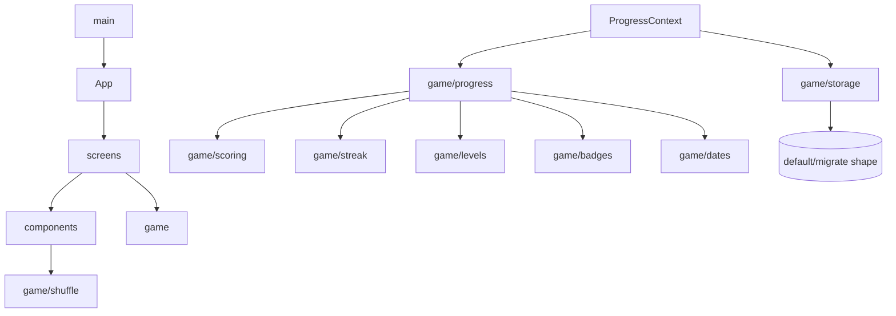
Direction is acyclic: `screens → components/game → game(leaf utils)`. No circular dependencies observed. `game/*` never imports from `screens`/`components`. **[VERIFIED]**

## 110. Source-of-Truth Matrix

| Information | Source of truth |
|------------|-----------------|
| User progress/xp/coins/streak | `localStorage` `gkquest.progress.v1` (via `ProgressContext`) |
| Questions / content | `src/data/day-*.json` (static) |
| Scoring/level/streak/badge rules | `game/*.js` constants & functions |
| Equipped cosmetics | `progress.avatar/theme` |
| Journey structure (worlds/boss/finale) | `game/journey.js` |
| Shop catalog | `game/shop.js` |
| "Today" / streak day | device local date (`game/dates.js`) |
| Subscription/payment | **[N/A]** none |

## 111. Data Ownership (domains)
| Domain | Owner (module) |
|--------|----------------|
| Identity/settings | `ProgressContext` + `storage.js` (childName, pin, toggles) |
| Learning/content | `src/data/*` + `loadDay.js` |
| Assessment/scoring | `scoring.js`, `checkAnswer.js`, `progress.js` |
| Gamification | `levels.js`, `streak.js`, `badges.js`, `shop.js` |
| Presentation | `screens/*`, `components/*` |
| AI / analytics | **[N/A]** |

## 112. Domain Model
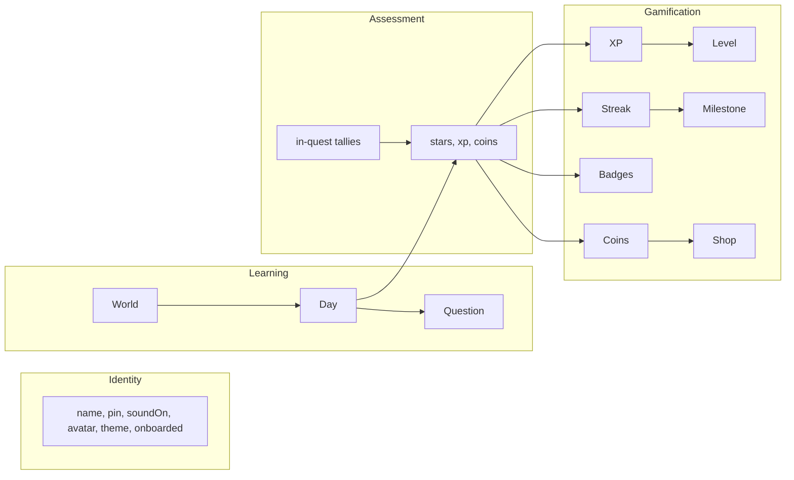

## 113. Quality Attributes
| Attribute | Assessment |
|-----------|-----------|
| Availability | High (static/CDN + offline PWA); no server to fail |
| Reliability | Good; defensive storage/content handling; missing ErrorBoundary |
| Scalability | High for the current model (independent clients); product-limited without backend |
| Maintainability | Good structure & comments; weakened by no types/tests/lint |
| Security | Low attack surface (no server/secrets); weak local gate; tamperable |
| Usability | Strong kid-first UX; responsive; delightful |
| Performance | Strong (code-split, tiny assets, emoji art) |
| Observability | Absent |
| Testability | High potential (pure fns), currently untested |

---

## 114. Top 20 Architectural Findings

1. **No backend/DB/AI/auth at runtime** — the app is a pure client PWA. *Evidence:* entire `src/`, `package.json`. *Impact:* shapes everything; no server risks, but no sync/analytics/notifications. *Rec:* keep for one child; add a `storage.js`-seam backend only to scale. *Pri:* informational.
2. **Content only 30% authored (27/90 days).** *Evidence:* `src/data/`. *Impact:* journey unfinishable; finale/most bosses/reviews absent. *Rec:* author 21–67, 75–90. *Pri:* P0.
3. **Current-affairs staleness (dated 2026-07-26).** *Evidence:* `lastUpdated` on 68–74. *Impact:* wrong answers over time. *Rec:* scheduled regeneration + freshness CI. *Pri:* P0.
4. **No tests.** *Evidence:* none in repo. *Impact:* silent regressions in core math. *Rec:* Vitest for `game/*`. *Pri:* P1.
5. **No ErrorBoundary.** *Evidence:* `App.jsx`. *Impact:* white-screen on render error. *Rec:* wrap routes. *Pri:* P1.
6. **No monitoring/analytics.** *Evidence:* none. *Impact:* production is blind. *Rec:* opt-in error logging. *Pri:* P1.
7. **Weak parent gate; `/settings` ungated.** *Evidence:* `App.jsx`, `Settings.jsx`. *Impact:* child edits settings/PIN. *Rec:* gate `/settings`. *Pri:* P2.
8. **State fully client-side & tamperable.** *Evidence:* `storage.js`. *Impact:* values editable; no backup redundancy. *Rec:* accept for 1 child; server if shared. *Pri:* P2.
9. **`image_mcq` implemented but unused; no art.** *Evidence:* data + `src/assets`. *Impact:* dormant feature. *Rec:* add content or drop. *Pri:* P2.
10. **No content-schema validation in CI.** *Evidence:* no validator. *Impact:* malformed JSON crashes a day. *Rec:* JSON-schema check. *Pri:* P1/P2.
11. **`difficulty` metadata unused at runtime.** *Evidence:* `data` vs engine. *Impact:* no adaptivity. *Rec:* use it or document as authoring-only. *Pri:* P3.
12. **No ESLint/Prettier config despite `eslint-disable` usage.** *Evidence:* `package.json`. *Impact:* inconsistency. *Rec:* add configs. *Pri:* P2.
13. **`.claude/settings.local.json` committed with presigned URLs.** *Evidence:* that file. *Impact:* hygiene. *Rec:* git-ignore + scrub. *Pri:* P1(hygiene).
14. **First-load requires network (PWA cold-start).** *Evidence:* SW model. *Impact:* no offline on very first open. *Rec:* document; acceptable. *Pri:* Low.
15. **Local-time streak logic.** *Evidence:* `dates.js`. *Impact:* clock/timezone edge cases. *Rec:* document; UTC if scaled. *Pri:* Low.
16. **Accessibility gaps (reduced-motion, focus, emoji semantics).** *Evidence:* components. *Rec:* a11y pass. *Pri:* P2.
17. **Screens eagerly imported.** *Evidence:* `App.jsx`. *Impact:* slightly larger initial JS. *Rec:* `React.lazy`. *Pri:* P3.
18. **Dead CSS classes.** *Evidence:* `index.css`. *Rec:* remove. *Pri:* P3.
19. **No i18n / English-only.** *Evidence:* strings. *Impact:* single-locale. *Rec:* fine for scope. *Pri:* Low.
20. **Excellent separation of concerns & extensibility seams** (question REGISTRY, badge/journey/shop arrays, `storage.js` boundary). *Evidence:* `game/`+`Quest.jsx`. *Impact:* positive — easy to extend/back with a server later. *Pri:* strength to preserve.

## 115. Top 20 Next Engineering Tasks

**Immediate**
1. Author missing day content (21–67, 75–90) + boss/review/finale sets. *(→ §17.1)*
2. Add a JSON-schema validator + `npm run validate:content` and wire to CI. *(→ §26/§63)*
3. Refresh current-affairs (68–74, 72); bump `lastUpdated`. *(→ §27)*
4. Add an ErrorBoundary with a friendly Gyaan fallback. *(→ §47)*
5. Gate `/settings` behind the parent PIN. *(→ §14)*
6. Git-ignore + scrub `.claude/settings.local.json`. *(→ §53)*

**Next**
7. Vitest unit tests for `scoring`, `streak`, `progress`, `badges`, `checkAnswer`. *(→ §63)*
8. ESLint + Prettier config + `lint` script. *(→ §71)*
9. Minimal CI: install → build → lint → test → validate content → deploy `dist/`. *(→ §61)*
10. Add `prefers-reduced-motion` handling + visible focus rings. *(→ §85)*
11. `React.lazy` route-level screens. *(→ §46)*
12. Remove dead CSS; add image questions or drop `image_mcq`. *(→ §72)*
13. Optional: self-host fonts to remove the last runtime third party. *(→ §69)*

**Later (only if scaling beyond one child)**
14. Introduce a backend sync behind `storage.js` (Firebase or similar). *(→ §9/§75)*
15. Real auth + multi-profile (second child). *(→ §13)*
16. Local notifications / daily reminder (SW push). *(→ §40)*
17. Privacy-respecting, consented analytics + funnel. *(→ §38/§39)*
18. Leaderboard (requires backend). *(→ §35)*
19. Authoring CMS + factual-verification workflow (sources/RAG). *(→ §27/§43)*
20. TypeScript migration for compile-time safety. *(→ §74)*

---

## 116. Glossary
- **Quest** — one day's quiz (12 normal / 15 boss questions).
- **World** — a 30-day segment (Bharat Basics / World Explorer / Champion's Arena).
- **Boss / Review / Finale day** — special days (`journey.js`): boss quizzes, month reviews (30/60), Day-90 finale.
- **Gate** — `canStartDay`: current day + past-day replays allowed; future days locked.
- **XP** — permanent score → rank/level. **Coins** — spendable (cosmetics). **Stars** — 1–3 per quest.
- **Combo multiplier** — ×1/×2/×3 for consecutive correct answers in a quest.
- **Streak** — consecutive calendar days played; **freeze token** forgives one miss.
- **Badge** — achievement (20 total, 4 groups). **Rank** — one of 9 XP levels (Rookie→Grandmaster).
- **Practice Mode** — parent-unlocked replays/mixed quiz (no XP/coins/streak).
- **Gyaan** — the owl mascot. **Progress** — the single localStorage record.
- **`lastUpdated`** — freshness date on current-affairs day files.

## 117. Appendix: Environment Requirements
Node **18+**, npm; a modern browser (service workers, Web Audio, `dvh`). No Python/Docker/DB. OS-agnostic (built/tested on macOS). CLI: `git` (recommended), `npm`.

## 118. Appendix: Command Reference
```bash
# Development
npm install         # install deps
npm run dev         # dev server (http://localhost:5173) — no service worker

# Build / preview
npm run build       # production build → dist/ (with PWA service worker)
npm run preview     # serve dist/ locally (test PWA + offline)

# Deploy
# → drag-drop dist/ to Netlify, or connect repo (build: npm run build, publish: dist)
```
(Only these three npm scripts exist; no test/lint scripts yet.)

## 119. Appendix: Full "API" Index
**[N/A]** No HTTP API. Internal module contracts indexed in §10.

## 120. Appendix: Full "Database" Index
**[N/A]** No DB. The single persisted object (`gkquest.progress.v1`) is specified in §11. Content "tables" = `src/data/day-*.json` (schema in §17/`schema.md`).

## 121. Appendix: Third-Party Services
Runtime: Static host (serves files), Google Fonts (first load, cached). That's all. Dev-only: Higgsfield/MCP media tooling (marketing video; not in product).

## 122. Appendix: Important File Index
| File | One-liner |
|------|-----------|
| `src/main.jsx` | React root; providers; no StrictMode |
| `src/App.jsx` | 7 routes + ThemeApplier + SoundSync |
| `src/index.css` | Tailwind layers + design-system classes + safe-area/fluid utils |
| `src/game/progress.js` | **Core reducer** `applyCompletion` + gate helpers |
| `src/game/ProgressContext.jsx` | Context provider; persist; purchase/import/reset |
| `src/game/storage.js` | localStorage load/save/migrate/export/import |
| `src/game/scoring.js` | points, speed bonus, combo, stars |
| `src/game/streak.js` | streak transitions + milestones |
| `src/game/levels.js` | 9-rank XP ladder |
| `src/game/badges.js` | 20 badges + evaluation |
| `src/game/journey.js` | worlds + boss/review/finale days |
| `src/game/checkAnswer.js` | per-type answer validation |
| `src/game/loadDay.js` | lazy content loader + mixed practice |
| `src/game/shop.js` | cosmetic catalog + ownership |
| `src/game/certificate.js` | canvas → PNG certificate |
| `src/game/sound.js` | Web Audio SFX |
| `src/screens/Quest.jsx` | quiz engine UI + question registry |
| `src/screens/Home.jsx` | journey map + HUD + backup |
| `src/screens/Results.jsx` | celebration + recap |
| `src/data/schema.md` | question data contract |
| `vite.config.js` | Vite + PWA (manifest + Workbox) |
| `tailwind.config.js` | kid-friendly theme |

---

## Architecture in One Page
- **Client:** React 18 + Vite SPA/PWA, JavaScript, Tailwind, Framer Motion, react-router. Phone-first, installable, fully offline after first load.
- **Backend / Database / API / Auth / AI / Analytics:** **none** — everything runs in the browser.
- **State:** one `localStorage` record via `ProgressContext`; pure-JS engine in `src/game/`.
- **Core learning engine:** `Quest.jsx` + `checkAnswer` + `scoring` → `applyCompletion` commits XP/coins/stars/streak/badges once per quest.
- **Content:** static per-day JSON, code-split; **only 27/90 days authored**; current-affairs dated.
- **Gamification:** XP→9 ranks, coins→cosmetic shop, 1–3 stars, combos, streaks+freezes, 20 badges, certificate.
- **Deployment:** build `dist/`, drop on a static host (Netlify); SPA fallback via `_redirects`.
- **Security/privacy:** no secrets, no data egress, strong privacy; weak client PIN; state is tamperable.
- **Key risks:** incomplete content, factual staleness, no tests/monitoring/error-boundary.

## If the Entire Engineering Team Changed Tomorrow
A new team needs to know:
1. **It's a static, client-only PWA** — no servers to operate; "deploy" = publish `dist/` to a static host; SPA fallback required.
2. **All state is one `localStorage` object** (`gkquest.progress.v1`); the reducer is `game/progress.js#applyCompletion`; persistence is `game/storage.js`. Debug by inspecting that key in DevTools.
3. **Content = `src/data/day-*.json`** to the contract in `src/data/schema.md`; add a day by adding a file (and it auto-code-splits). **Only 27/90 days exist**; current-affairs files (68–74) must be periodically refreshed.
4. **Extending gameplay** = edit the arrays/constants in `game/` (`levels`, `scoring`, `streak`, `badges`, `journey`, `shop`) and, for new question types, add a renderer + `REGISTRY` entry + `checkAnswer` case.
5. **There is no AI, auth, DB, or analytics** to maintain; don't go looking for them. The only runtime third parties are the host and Google Fonts.
6. **First hardening steps** (in order): finish/validate content, refresh current-affairs, add an ErrorBoundary, add Vitest for `game/*`, gate `/settings`, scrub `.claude/settings.local.json`.
7. **Run it:** `npm install && npm run dev`; test offline with `npm run build && npm run preview`.

---

### Maintenance note
Keep this document a **living source of truth**: after any significant feature change (new screen, new question type, scoring/streak/badge rules, content batches, or the introduction of any backend/AI/analytics), update the affected sections **and** the §101 scorecard / §114 findings so it never drifts from the code.

*Document generated by repository inspection on 2026-08-18. Every "[VERIFIED]" claim traces to the cited file; every "[N/A]"/"[FUTURE]" marks something that does not exist in the repo today.*
